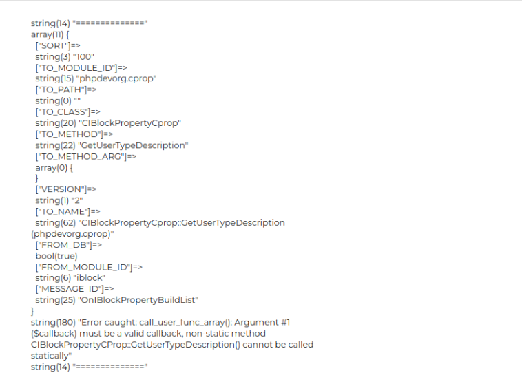

# Исправление ошибок на сайте Bitrix при переходе на PHP 8 и более
1. [Ошибка в работе функции call_user_func_array()](#title1)
2. [Ошибка в работе функции count() или in_array()](#title2)
3. [Ошибка в файле component.php](#title3)

---

### <a id="title1">Ошибка в работе функции call_user_func_array()</a>

В некотором случае данная ошибка была связана с использованием сторонних модулей которые уже не поддерживаются и которые 
не обновили свой код до версии PHP 8.

Для того чтобы определить какой модуль вызывает ошибку переходим в файл указанный в ошибке,
пример — `/bitrix/modules/main/classes/general/module.php`

Читаем ошибку и смотрим на какой строке выпадает ошибка. В данном случае ошибка возникает в методе `ExecuteModuleEventEx`.

Теперь настроим отлов ошибок с помощью конструкции `try catch`, 
а так же перед отловом выведем данные о модуле который запускается.

Это временное решение поэтому не нужно заменять или удалять текущий код. 
После решения проблем вам нужно будет вернуть старый код.

Пример:

```php 
/* отлавливаем ошибки */
try {
    $resultData = call_user_func_array(array($arEvent["TO_CLASS"], $arEvent["TO_METHOD"]), $args);
} catch (Error $e) {
    echo "<pre>";
    var_dump("==============");
    var_dump($arEvent);
    var_dump("Error caught: " . $e->getMessage());
    var_dump("==============");
    echo "</pre>";
}

return $resultData;
/* ---------------- */
```

Вывод ошибки кривоват, но он даёт результат! Теперь обновив страницу сайта вы можете видеть следующий код



Здесь в параметре `TO_MODULE_ID` указано название модуля который вызывает ошибку.

Далее есть 3 решения:

- перейти директорию модуля, найти класс указанный в параметре `TO_CLASS` и настроить метод указанный в параметре `TO_METHOD`, 
сделав его статичным (`public static function`). Если модуль установлен через магазин расширений `Bitrix`, 
то скорее всего он находится в директории `/bitrix/modules/название_модуля`
- написать разработчикам и попросить исправить ошибки
- отключить модуль и найти рабочее решение 

---

### <a id="title2">Ошибка в работе функции count() или in_array()</a>

Скорее всего данная ошибка связана в попытке передать данным функциям пустые массивы или данные неправильного типа.

Ранее эти функции возвращали false при попытке передать им пустой массив. Сейчас же будет выводиться ошибка.

В качестве решения вы можете обернуть код условием `if` и проверить переменную на тип `array` или на пустоту.

---

### <a id="title3">Ошибка в файле component.php</a>

Ошибка выглядит примерно так 

```
array_key_exists(): Argument #2 ($array) must be of type array, null given (0)
/home/user/web/site.ru/public_html/bitrix/modules/main/classes/general/component.php:783
```

Для решения вы можете заменить функцию `array_key_exists()` на конструкцию `!empty($this->arResult[$key])`.

```php 
/* было */
if(array_key_exists($key, $this->arResult)) {
    $arNewResult[$key] = $this->arResult[$key];
}

/* стало */
if(!empty($this->arResult[$key])) {
    $arNewResult[$key] = $this->arResult[$key];
}
```